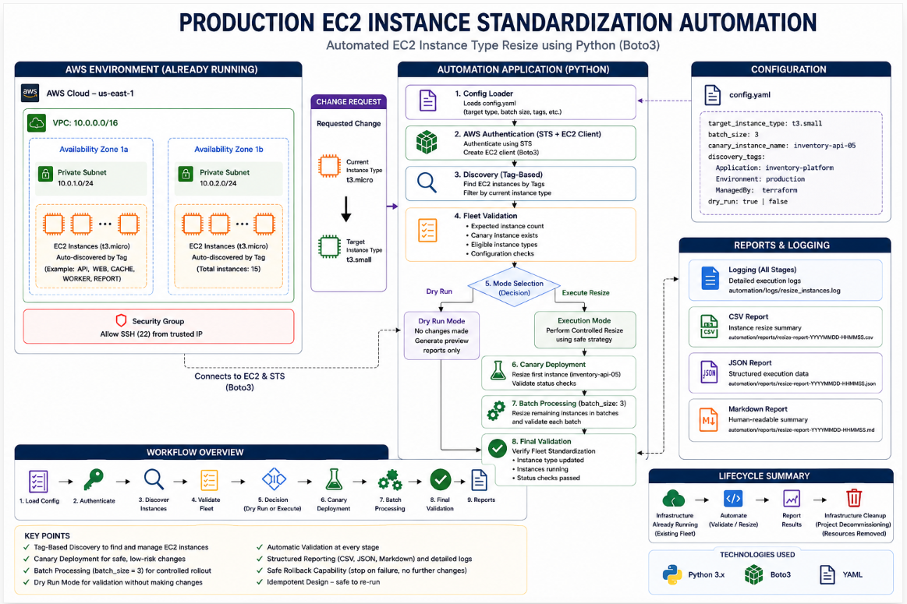
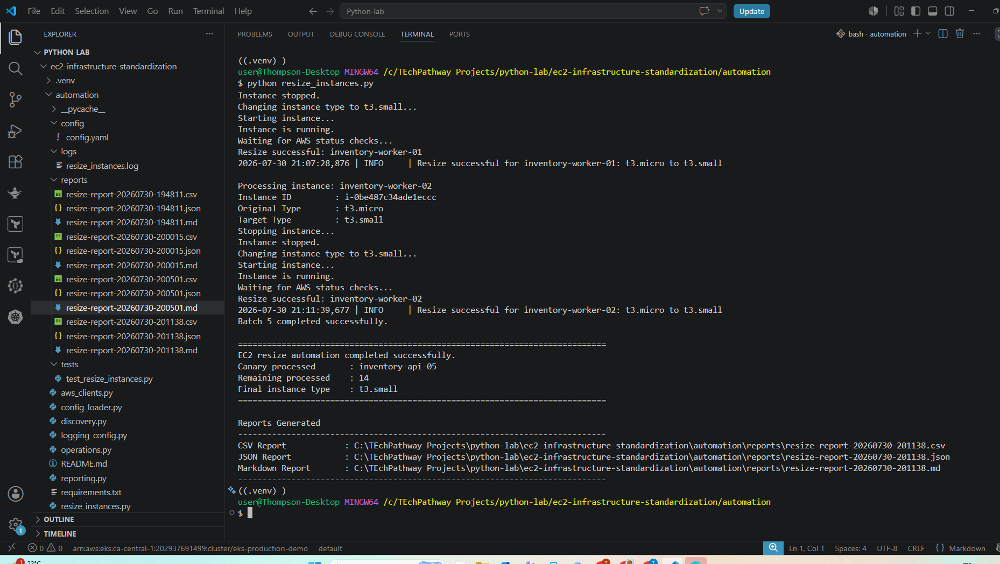
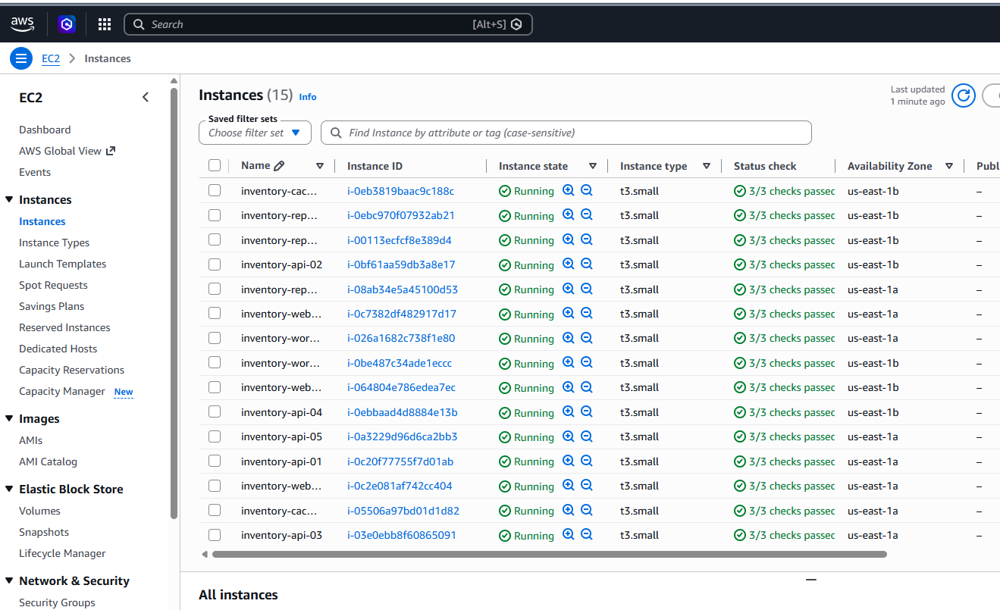

# 🚀 Production EC2 Instance Standardization Automation


A Python automation solution that safely standardizes an existing fleet of Amazon EC2 instances using AWS APIs, fleet validation, canary deployment, and configurable batch processing.

---

### Solution Architecture

The diagram below illustrates the end-to-end workflow of the EC2 instance standardization process.



---

## Overview

Managing infrastructure changes across multiple Amazon EC2 instances manually can be slow, error-prone, and difficult to audit.

This project automates EC2 instance standardization using Python and the AWS SDK (Boto3). It discovers target instances through AWS resource tags, validates the fleet, performs a canary deployment followed by configurable batch processing, and generates structured reports for auditing and troubleshooting.

The automation is designed to operate against an existing AWS environment. Terraform is included to provision a reproducible demonstration environment for development, testing, and validation.
---

## Engineering Decisions

This project was designed with production-inspired operational practices in mind, including:

- Dynamic EC2 discovery using AWS resource tags
- Configuration-driven execution with YAML
- Dry Run validation before infrastructure changes
- Canary-first deployment strategy
- Configurable batch processing to reduce operational risk
- Post-deployment verification
- Structured reporting for auditability
- Modular Python architecture for maintainability and extensibility

## How It Works

1. Load configuration from `config.yaml`
2. Authenticate with AWS
3. Discover tagged EC2 instances
4. Validate the target fleet
5. Execute a Dry Run or Live Execution
6. Resize a canary instance
7. Process the remaining instances in batches
8. Verify successful completion
9. Generate execution reports

...
---

## Key Features

- Tag-based EC2 discovery
- YAML-driven configuration
- AWS authentication using STS and Boto3
- Fleet validation before execution
- Dry Run mode
- Canary deployment strategy
- Configurable batch processing
- Automatic fleet verification
- CSV, JSON and Markdown reporting
- Comprehensive execution logging
- Modular Python architecture

---

## Technology Stack

| Category | Technology |
|------------|------------|
| Language | Python |
| Cloud | AWS |
| AWS Services | EC2, STS |
| SDK | Boto3 |
| Configuration | YAML |
| Infrastructure | Terraform *(Demo Environment)* |
| Reporting | CSV, JSON, Markdown |
| Logging | Python Logging |

---

## Repository Structure

## Repository Structure

```text
.
├── automation/          # Core automation engine
├── infrastructure/      # Terraform demo environment
├── assets/              # README images
├── docs/                # Technical documentation
├── requirements.txt
└── README.md
```
---

## Running the Project

### Prerequisites

- Python 3.11+
- AWS CLI configured
- Valid AWS credentials
- Existing AWS environment (or the included Terraform demo environment)

### Install Dependencies

```bash
pip install -r requirements.txt
```

### Configure the Application

Update `config.yaml` with your AWS Region, target EC2 tags, desired instance type, batch size, and execution mode.

### Execute

Dry Run:

```bash
python resize_instances.py
```

Live Execution:

Set:

```yaml
dry_run: false
```

Then run:

```bash
python resize_instances.py
```
---
## Execution Results

### Successful Fleet Standardization



### AWS Console Verification



---

## Documentation

Detailed technical documentation is available in the `docs/` directory.

| Document                | Purpose                                        |
| ----------------------- | ---------------------------------------------- |
| Architecture            | System architecture and component interactions |
| Deployment Guide        | Environment setup and prerequisites            |
| Execution Workflow      | End-to-end automation lifecycle                |
| Configuration Reference | Configuration options and examples             |
| Reporting               | Generated reports and logging                  |
| Troubleshooting         | Common issues and resolutions                  |
| Design Decisions        | Key engineering decisions and trade-offs       |

---

## License

This project is licensed under the MIT License.

---

## Further Reading

Comprehensive project documentation, design decisions, implementation details, and deployment guidance are available in the `docs/` directory.