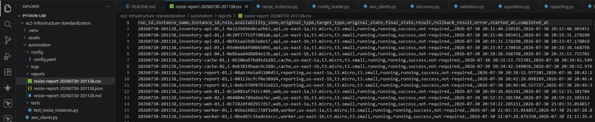

# Production EC2 Fleet Standardization Automation

This project demonstrates a production-inspired workflow for safely standardizing Amazon EC2 fleets using Python and AWS Boto3. 


## Solution Architecture


---

## Overview

Infrastructure changes become increasingly risky as environments scale.

Although modifying a single EC2 instance is relatively straightforward, applying the same operational change consistently across an entire fleet introduces challenges around validation, deployment safety, observability, and repeatability.

---

## Engineering Principles

The automation was designed around operational engineering principles rather than simply automating API calls.

- Safety before speed
- Fail-fast validation
- Canary-first deployment
- Configuration-driven execution
- Separation of infrastructure and operations
- Modular architecture
- Operational observability
- Repeatable execution

## Operational Workflow

1. Load configuration from `config.yaml`
2. Authenticate with AWS
3. Discover tagged EC2 instances
4. Validate the target fleet
5. Execute a Dry Run or Live Execution
6. Resize a canary instance
7. Process the remaining instances in batches
8. Verify successful completion
9. Generate execution reports

---

## Key Features

### Automation
- Tag-based EC2 discovery
- YAML-driven configuration
- Fleet validation before execution
- Dry Run mode
- Canary deployment strategy
- Configurable batch execution

### Operational Safety
- Automatic fleet verification
- Comprehensive execution logging
- CSV, JSON, and Markdown reporting

### Architecture
- Modular Python architecture
- AWS authentication using STS and Boto3
---

## Technology Stack

| Category | Technology |
|----------|------------|
| Language | Python |
| Cloud Platform | AWS |
| AWS SDK | Boto3 |
| AWS Services | EC2, STS |
| Configuration | YAML |
| Logging | Python Logging |
| Reporting | CSV, JSON, Markdown |
| Supporting Infrastructure | Terraform *(Demonstration Environment)* |

## Repository Structure

```text
.
├── automation/          # EC2 fleet standardization engine
├── assets/              # Architecture diagrams and execution screenshots
├── docs/                # Engineering design documentation
├── infrastructure/      # Terraform demonstration environment
├── requirements.txt
└── README.md
```

---
## Deployment

### Prerequisites

- Python 3.11+
- AWS CLI configured
- Valid AWS credentials
- An AWS account containing EC2 instances matching the configured resource tags, or the included Terraform demonstration environment.

### Install Dependencies

```bash
pip install -r requirements.txt
```

### Configure the Application

Update `config.yaml` with your AWS Region, target EC2 tags, desired instance type, batch size, and execution mode.


## Execution

Dry Run:

```bash
cd automation
python resize_instances.py
```

Live Execution:

Set:

```yaml
dry_run: false
```

Then run:

```bash
cd automation
python resize_instances.py
```
---
## Operational Validation

### Successful Fleet Standardization

The automation successfully authenticated with AWS, discovered all tagged EC2 instances, validated the fleet, executed a canary deployment followed by batch processing, and completed the standardization workflow


### Generated Audit Reports

The automation generates timestamped CSV, JSON, and Markdown reports containing execution status, original and target instance types, timestamps, rollback state, and error details for auditing and troubleshooting.



### AWS Console Verification


## Engineering Trade-offs

| Decision | Benefit | Trade-off |
|----------|----------|-----------|
| Canary deployment | Reduced deployment risk | Longer execution |
| Sequential batches | Easier troubleshooting | Increased runtime |
| Structured reports | Better auditability | Additional storage |
| Modular architecture | Maintainability | More project structure |


## Failure Scenarios

The automation intentionally terminates before infrastructure modification when:

- AWS authentication cannot be established.
- Fleet discovery does not match the expected environment.
- Validation detects inconsistent infrastructure state.
- Canary deployment fails.
- Batch execution encounters an unrecoverable infrastructure or AWS API failure.

## Technical Documentation

A detailed **Engineering Design Document** is available here:

📄 **[Engineering Design Document](docs/ec2-fleet-standardization-engineering-design.pdf)**

The document provides a deeper explanation of:

- Solution Architecture
- Engineering Principles
- Operational Workflow
- Validation Strategy
- Canary Deployment
- Batch Processing
- Reporting and Auditability
- Engineering Trade-offs
- Future Enhancements
--- 
## Future Enhancements

Planned improvements include:

- GitHub Actions CI/CD
- Automated Unit Testing
- AWS Systems Manager Integration
- CloudWatch Dashboards
- SNS Notifications
- EventBridge Scheduling
- Parallel Execution with Configurable Concurrency